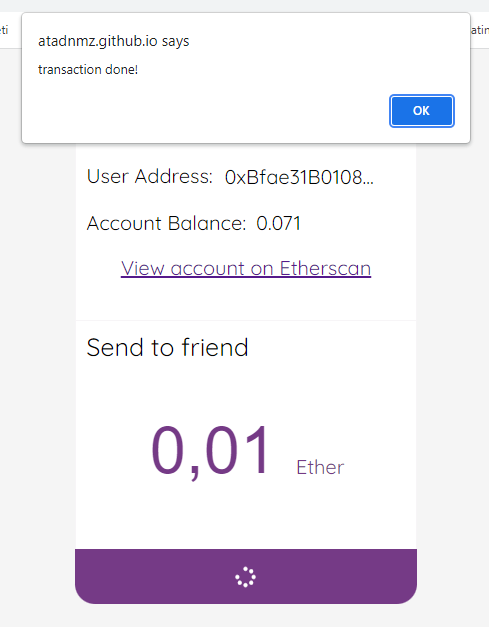

# send-eth-with-metamask

A simple ethereum send application via Metamask wallet. Please wait aprrox 15 seconds (Rinkeby Test Network) for block completion after transaction. Warning will be shown.

## Features

- This is just a blockchain interaction program
- Code is re written using [React JS 17](https://reactjs.org/docs/getting-started.html)
- [Webpack 4](https://webpack.js.org/concepts/) is used for the building purpose
- Latest features of JavaScript i.e. ES6, ES7, ES8 is used
- Web3.js is used to connect mainnet, rinkeby etc.
- In order to track transaction https://rinkeby.etherscan.io/ is used.

###### Note

Please use the test environments(eg: Rinkeby Test Network). I am not responsible for any loss that may occur when using Metamask.

## Installation

Clone the repository:

```
git clone https://github.com/atadnmz/send-eth-with-metamask.git
```

Navigate inside the directory:

```
cd send-eth-with-metamask
```

install node_modules
run `npm install`

start project
run `npm start`

## Screenshots

Some screens of the application is given below for better understanding.

<p> Initial screen <br/> 
 
  
</p>
<br/>
